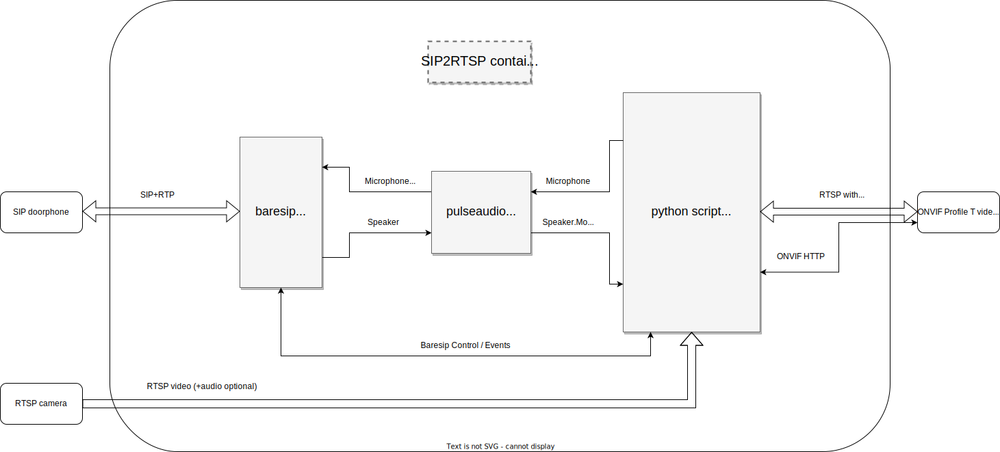

# SIP2RTSP
A docker container that uses [baresip](https://github.com/baresip/baresip), [pulseaudio](https://www.freedesktop.org/wiki/Software/PulseAudio/) and [gstreamer RTSP server](https://gstreamer.freedesktop.org/documentation/gst-rtsp-server/rtsp-onvif-server.html?gi-language=python) to provide a solution that connects to a SIP peer (audio only) and a video camera to present an ONVIF profile T video doorbell with two-way audio support.

Please the following block diagram how this is achieved.

## Block diagram
Click [here](https://raw.githubusercontent.com/nanosonde/sip2rtsp/main/docs/sip2rtsp_block_diagram.svg) to open the block diagram in full screen.

## Credits
The whole docker setup is based on the docker setup from the [FRIGATE project](https://github.com/blakeblackshear/frigate).
So all credits concerning the docker setup belongs to them.

## Features
* a SIP peer is called via baresip if the RTSP backchannel receives the RTSP SETUP request and hangs up on receiving a RTSP TEARDOWN request or connection is closed.
* Incoming SIP calls (SIP RINGING) trigger ONVIF events, e.g. doorbell event message. Currently only ONVIF pullpoint subscription is supported.
* well-known baresip SIP client is used to handle calls to and from the SIP video doorbell
* A SIP video doorbell could be easily created by just using any video-only camera combined with a two-way audio-only doorphone that is based on SIP or is using some SIP adapter that connects to an analogue two-way audio-only doorphone
* Everything is running in a docker container. No need to setup everything manually.
* A [single YAML config file](https://github.com/nanosonde/sip2rtsp/blob/main/config/config.yml.example) which controls all main aspects of the RTSP server an the ONVIF server
* Tested with the [scrypted](https://www.scrypted.app/) ONVIF plugin and [ONVIF device manager](https://sourceforge.net/projects/onvifdm/)

## Requirements

* docker (tested with 20.10.x on Ubuntu Jammy)

## Installation

1. Clone the GIT repo:

  `git clone https://github.com/nanosonde/sip2rtsp.git`

2. Prepare configration file based on the example config file:

  `cp config/config.yaml.example config/config.yaml`

3. Run the docker container in host networking mode:

  `make run`

4. Once the container has started, a new folder /config/baresip will be created.
   It contains two subfolders:
   * /config/baresip/default
   * /config/bareip/custom

  The container will always overwrite the default folder on container startup. If you want to change any settings, e.g. to create a SIP account in 
  the `acccounts` file. You can copy the file from the default folder to the custom folder and edit it as required.
  Upon next startup the new custom config file will be used.
  This way you can customize baresip to your own needs.
  
  Watch out for comments in the `config` file of baresip! Some things must not be changed to make the whole container logic work together!

~~Please note that the generated docker image uses a custom build of gstreamer and pulseaudio from this repository: https://github.com/nanosonde/pulsegst~~

~~Building gstreamer and pulseaudio takes a long time. So building those is done in a separate dockerfile.~~

**Recent versions (from 03/17/2023) of sip2rtsp use Debian Bookworm which already includes latest version of gstreamer and pulseaudio.**

## Configuration

See the comments provided in [config/config.yaml.example](https://github.com/nanosonde/sip2rtsp/blob/main/config/config.yml.example)

## Ports
When the docker container is running in host networking mode, it will use the following ports (default config):
* 4444(TCP): Baresip [TCP control interface using netstring (JSON)](https://github.com/baresip/baresip/blob/main/modules/ctrl_tcp/ctrl_tcp.c)
* 8000(TCP): Baresip HTTP control interface
* 19554(TCP): gstreamer ONVIF RTSP server (Python3 script with gstreamer Python bindings)
* 10101(TCP): ONVIF SOAP HTTP Port (Python3 script)

## TODO
* Add more error handling and more logic to the ONVIF server written in Python3
* Currently only ONVIF pullpoint subscription is supported. Add other mechanism as required
* need some real world example SOAP messages for ONVIF profile T video doorbells concerning doorbell events and reporting of two-way audio support
